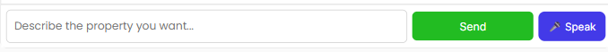
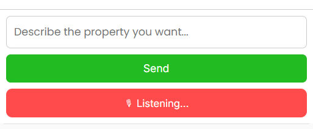
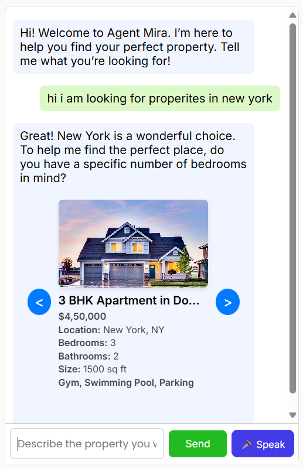
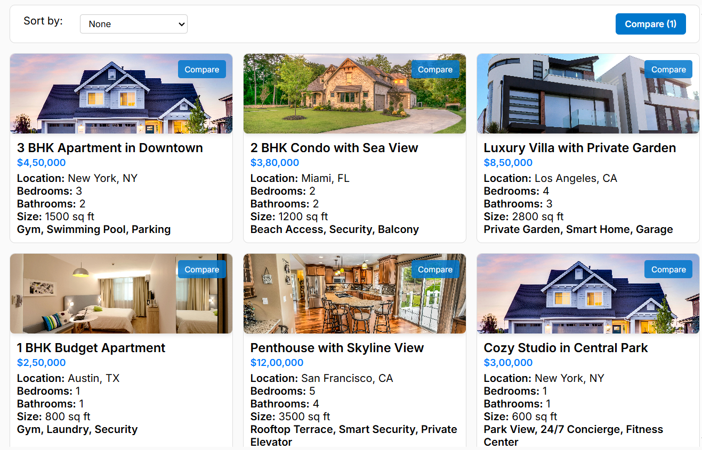
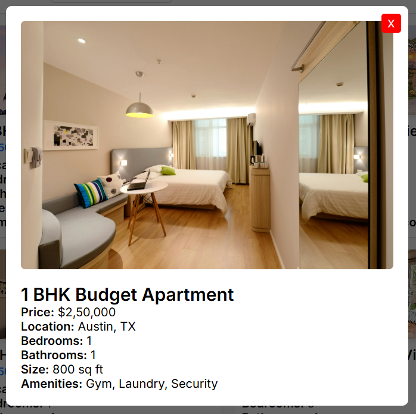
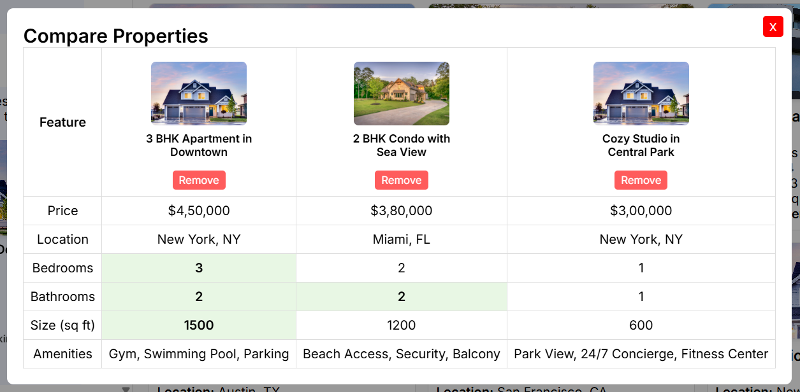
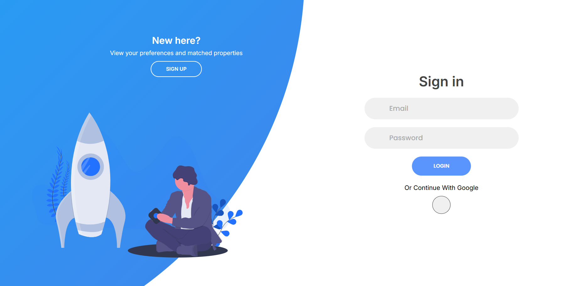
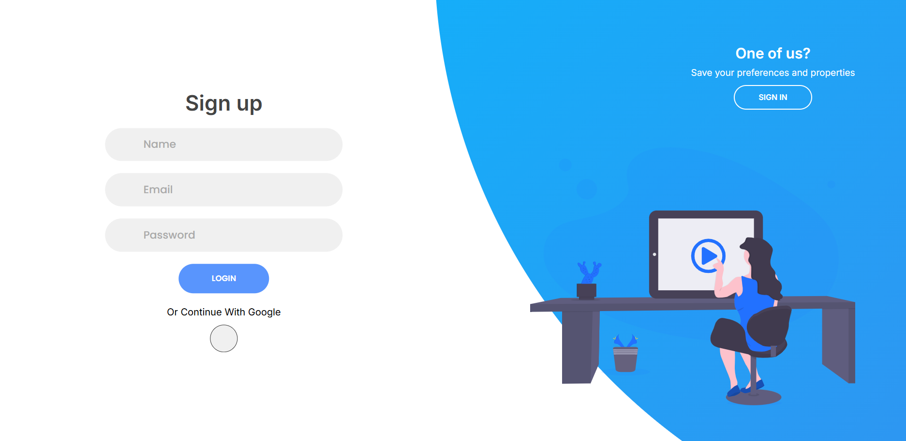

# 🏡 Agent Mira – AI Real Estate Assistant

Agent Mira is an interactive, AI-powered real estate assistant that helps users search for properties by typing or speaking their requirements.  
It displays results in a sleek property carousel, with a modal popup for full property details.

- Live Link: https://agent-mira-frontend.vercel.app
- Github Link: https://github.com/SanjeevThalod/agentMira-Frontend https://github.com/SanjeevThalod/agentMira-Backend

---

## 🚀 Features

### 1. **AI Chat Search**
Users can type their property search query into the search bar.

- **Automatic search trigger** after speech input
- **Seamless property search API integration**

---

### 2. **Speech-to-Text Search**
Click on the 🎤 button to speak your query.

- Uses **Web Speech API** in Chrome & Edge
- Automatically fills in the search bar with your spoken text
- Optionally triggers search instantly

---

### 3. **AI Chat Interface**  
Chat naturally with our specialized bot to describe your property needs.  

- Conversational messages between user and bot  
- Display of property suggestions inline with chat  
- Typing indicator for bot responses  
- Speech-to-text input support with microphone button  
- Scrolls automatically to newest messages  

---

### 4. **Property Carousel**
View search results in an interactive property slider.

- Smooth **slide animations** with Framer Motion
- Navigation arrows (`<` and `>`) to browse
- Click on a property to open **full details**

---

### 5. **Property Details Modal**
Clicking a property opens a modal popup with all details.

- Larger image preview
- Complete specifications (price, location, amenities)
- Close button to return to carousel

---

### 6. **Compare Properties**
Users can add properties to a compare list and view them side-by-side in a modal table.

- Add/remove properties from compare list  
- Highlights best values per feature (price, size, bedrooms)  
- Toggle compare modal on/off  

---

### 7. **User Authentication (Login & Signup)**  
Save your preferences and chat history securely by creating an account or logging in.  

  
*Login screen with email & password fields*

  
*Signup screen to create a new account*

- **Login** with email and password  
- **Signup** with name, email, and password  
- Validation for email format and password length  
- Persistent user session with cookies (\`credentials: include\`)  
- Preferences and chat messages saved and restored on login  
- Password security enforced (min length)  
- Option to login/signup using Google (placeholder for future integration)  

---

### How it works:

- On signup or login success, user data is saved in local storage and context  
- User preferences are automatically fetched and applied to filter property listings  
- Chat messages are stored and retrieved so you can continue your conversation seamlessly  
- Any preference changes or new chat messages update user data in backend and local storage  

